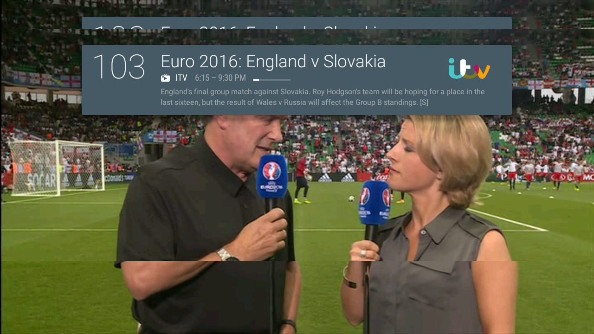
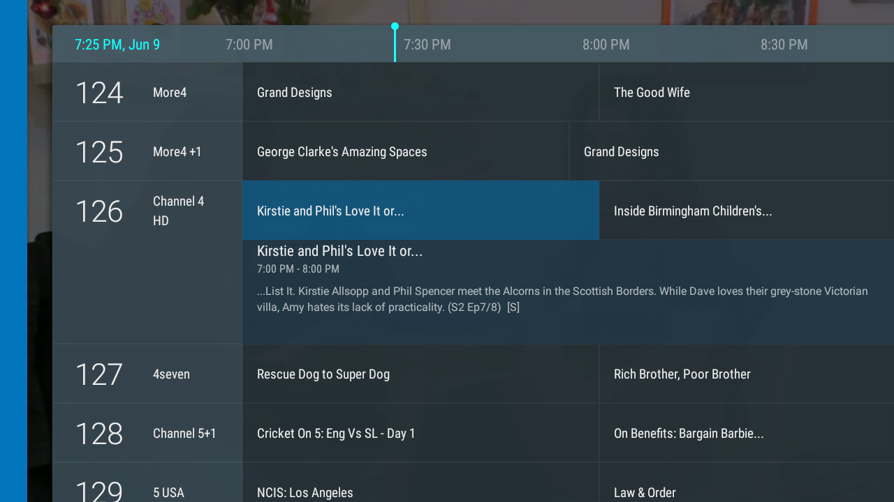

# Android TV + TVHeadend Live Channel

Available on Google Play:

1. Download from Google Play: https://play.google.com/store/apps/details?id=ie.macinnes.tvheadend

Sign up for Beta access (more frequent, bleeding edge releases):

1. Join the beta community (required!) https://plus.google.com/communities/102705346691784371187
2. Join the beta on Google Play: https://play.google.com/apps/testing/ie.macinnes.tvheadend
3. Download from Google Play: https://play.google.com/store/apps/details?id=ie.macinnes.tvheadend

IRC Channel:

Join #android-tvheadend on Freenode - not a general support channel, used for chatting with developers around specific bugs etc

